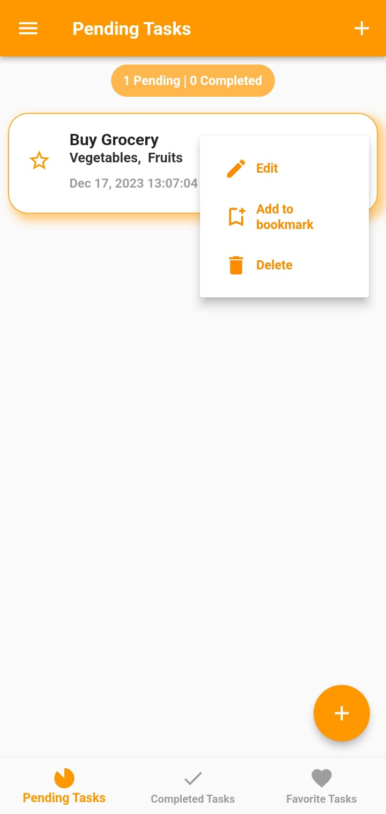
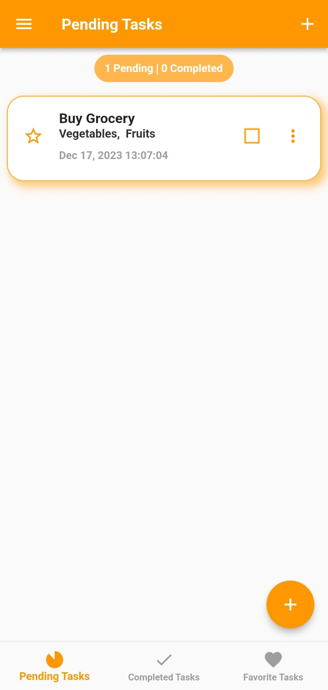
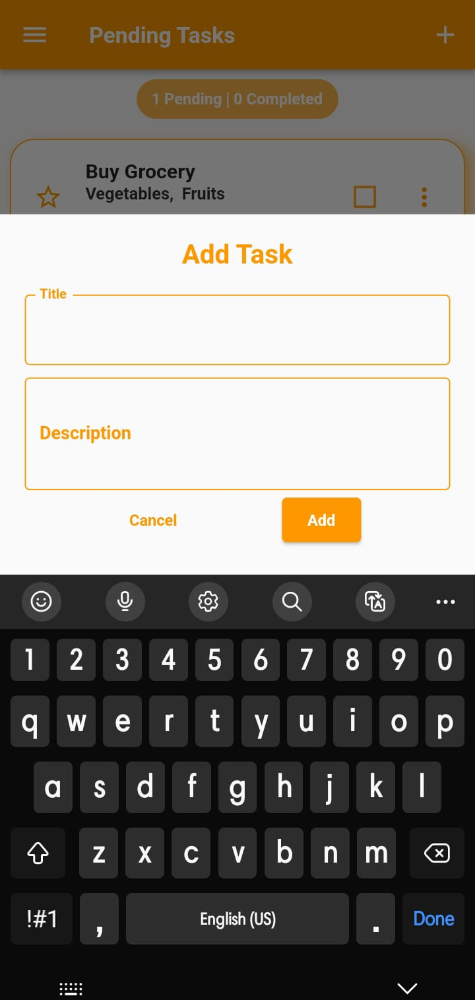
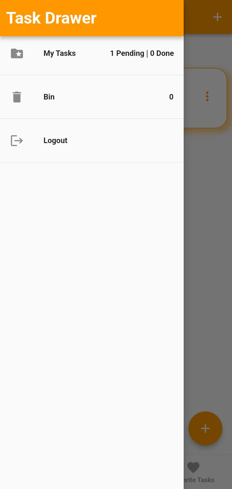

# Todo App
This is a simple todo application designed to manage your daily tasks efficiently. The app utilizes hydrated storage to persistently store task-related data, ensuring your tasks are saved even when you close the application. For user authentication, Firebase Auth is employed, providing a secure and seamless login experience. BLoC (Business Logic Component) state management is implemented within the app. This enables smooth task handling operations such as editing, favoriting, deleting, and restoring tasks as needed. Users can easily modify task details, mark tasks as favorites, delete unwanted tasks, and restore previously deleted tasks using this application.

## Project Screenshots

<!-- Row 1 -->

  
  
  

<!-- Row 2 -->

  
  

